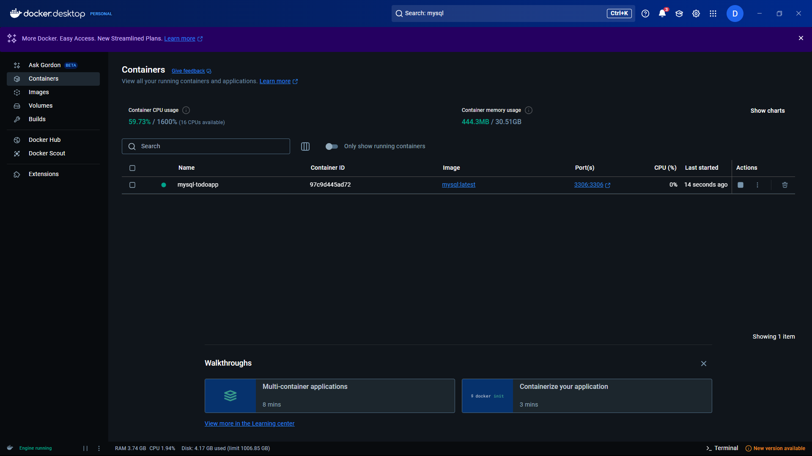

# Go To-Do App ~~with MS SQL~~ - SQL Backends with and without ORM

This README documents my journey learning Go and building a simple **To-Do** application using **Gin (Go web framework)** and **Microsoft SQL Server**. This guide covers setup, installation, improvements, and how to run the project.

A progression of working with different SQL backends and techniques in Go:

| Branch         | Description                            |
|----------------|----------------------------------------|
| `main`         | Plain Go + MSSQL (no ORM)              |
| `gorm-mssql`   | Same MSSQL backend, using GORM ORM     |
| `gorm-mysql`   | GORM ORM with MySQL backend            |

---

## Branch: mysql-gorm

This branch builds on the vanilla MSSQL implementation by introducing [GORM](https://gorm.io/), a powerful ORM library for Golang.

### Benefits of using GORM:
- Simplifies database interactions using structs and methods
- Auto-migrates your schema (optional)
- Abstracts raw SQL queries for CRUD operations
- Makes switching databases easier (support for PostgreSQL, MySQL, SQLite, SQL Server, etc.)

> ⚠️ Note: Since the `Tasks` table was dropped earlier, ensure that the database schema is recreated before running this version. You can let GORM handle the migration via `AutoMigrate()` or run the SQL manually via SSMS.

---

## 1️⃣ Setup GORM with MySQL
I'm assuming you had read the readme.md from the main branch and later explore this branch. Otherwise, go back to the main branch to setup your environment.

### **Install GORM and the MySQL driver**
Run this in your terminal to add GORM and the MySQL dialect:
```sh
go get -u gorm.io/gorm
go get -u gorm.io/driver/mysql
```

## 2️⃣ Replace `sql.DB` with GORM’s `*gorm.DB`

Update your imports and setup to look like this:
```go
import (
    "fmt"
    "log"
    "net/http"
    "os"
    "strconv"

    "github.com/gin-gonic/gin"
    "github.com/joho/godotenv"

    "gorm.io/driver/mysql"
    "gorm.io/gorm"
)

var db *gorm.DB
```

## 3️⃣ Database Setup and Replace all `db.Exec` and `db.Query` with GORM-style calls
- Update your DB connection logic:
```go
connString := fmt.Sprintf("%s:%s@tcp(%s:%s)/%s?charset=utf8mb4&parseTime=True&loc=Local",
    os.Getenv("MYSQL_USER"),
    os.Getenv("MYSQL_PASSWORD"),
    os.Getenv("MYSQL_HOST"),
    os.Getenv("MYSQL_PORT"),
    os.Getenv("MYSQL_DB"),
)
    
db, err = gorm.Open(mysql.Open(connString), &gorm.Config{})
if err != nil {
    log.Fatal("Failed to connect to database: ", err)
}

err = db.AutoMigrate(&Task{})
if err != nil {
    log.Fatal("AutoMigrate failed: ", err)
}
```
- Here’s how to update your routes:  
🟢 Get All Tasks
```go
func getTasks() []Task {
    var tasks []Task
    result := db.Find(&tasks)
    if result.Error != nil {
        fmt.Println("Error fetching tasks:", result.Error)
    }
    return tasks
}
```
🟢 Add Task
```go
r.POST("/add", func(c *gin.Context) {
    text := c.PostForm("text")
    if text != "" {
        task := Task{Text: text, Done: false}
        if result := db.Create(&task); result.Error != nil {
            c.String(http.StatusInternalServerError, "Error adding task: "+result.Error.Error())
            return
        }
    }
    c.Redirect(http.StatusSeeOther, "/")
})
```
🟢 Mark Task as Done
```go
r.POST("/done/:id", func(c *gin.Context) {
    id, err := strconv.Atoi(c.Param("id"))
    if err == nil {
        result := db.Model(&Task{}).Where("id = ?", id).Update("done", true)
        if result.Error != nil {
            c.String(http.StatusInternalServerError, "Error marking task as done: "+result.Error.Error())
            return
        }
    }
    c.Redirect(http.StatusSeeOther, "/")
})
```
🟢 Delete Task
```go
r.POST("/delete/:id", func(c *gin.Context) {
    id, err := strconv.Atoi(c.Param("id"))
    if err == nil {
        result := db.Delete(&Task{}, id)
        if result.Error != nil {
            c.String(http.StatusInternalServerError, "Error deleting task: "+result.Error.Error())
            return
        }
    }
    c.Redirect(http.StatusSeeOther, "/")
})
```

## 4️⃣ Setting up MySQL in Docker:
- Open your terminal and run this command:
```sh
docker run --name mysql-todoapp \
  -e MYSQL_ROOT_PASSWORD=rootpassword \
  -e MYSQL_DATABASE=TodoApp \
  -p 3306:3306 \
  -d mysql:latest
```

- Access the MySQL Container by using the command line or a GUI (like MySQL Workbench). Here’s how to use the command line, then type your password:
```sh
docker exec -it mysql-todoapp mysql -uroot -p
```
- We're going to let GORM's `AutoMigrate` handle the table creation.
- Optional: Use MySQL Workbench to verify data is indeed there.
- Optional: Stop & Start the Container Later
```sh
docker stop mysql-todoapp
```
```sh
docker start mysql-todoapp
```

## 5️⃣ Running the Application
### Start the Server
```sh
go run .
```
### Access the App
Open a browser and visit:
```
http://localhost:8080
```

## 6️⃣ Clean Up Resources
- I drop my `TodoApp` database using:
```sql
USE master;
ALTER DATABASE TodoApp SET SINGLE_USER WITH ROLLBACK IMMEDIATE;
DROP DATABASE TodoApp;
```
- Uploaded this to GitHub and deleted the local copy. (Well, you can skip these.)

## 7️⃣ Future Improvements
- **Dockerize the application** to simplify deployment.
- **Use connection pooling** for better SQL performance.
- **Convert to a REST API** for frontend frameworks like React or Vue.
- **Add authentication** to restrict access.

## 8️⃣ Summary
This project helped me learn Go while building a CRUD-based To-Do app with MySQL Server with GORM. The journey included:
✅ Setting up the environment  
✅ Connecting Go to MySQL Server running on docker  
✅ Creating RESTful endpoints  
✅ Rendering tasks in an HTML frontend  
✅ Implementing database CRUD operations but with GORM (**no SQL statements**)

## 9️⃣ Finding out more
1. I want to implement least priviledge where in development, I keep `AutoMigrate(&Task{})` and comment it out in production.
- GORM itself doesn't know your environment (dev, staging, prod) unless you tell it. You can do this using an ENV variable, like:
```env
APP_ENV=development
```
```go
appEnv := os.Getenv("APP_ENV")

if appEnv == "development" {
    err = db.AutoMigrate(&Task{})
    if err != nil {
        log.Fatalf("AutoMigrate failed: %v", err)
    }
}
```
- **Environment Behavior**
    - In development mode (`APP_ENV=development`), GORM will automatically create or update the database schema using `AutoMigrate`.
    - In production (`APP_ENV=production`), `AutoMigrate` is skipped to prevent accidental schema changes. Schema should be managed using SQL migration tools.
    - 📌 Make sure to **create the `Tasks` table manually** in production or use a migration strategy.

## 🔟 References
- [Configure Go with Visual Studio Code](https://learn.microsoft.com/en-us/azure/developer/go/configure-visual-studio-code) 
- [Go Documentation](https://go.dev/doc/)
- [Gin Web Framework](https://github.com/gin-gonic/gin)
- [Microsoft SQL Server](https://www.microsoft.com/en-us/sql-server/)
- [GoDotEnv](https://pkg.go.dev/github.com/joho/godotenv)
- [GORM Documentation](https://gorm.io/)